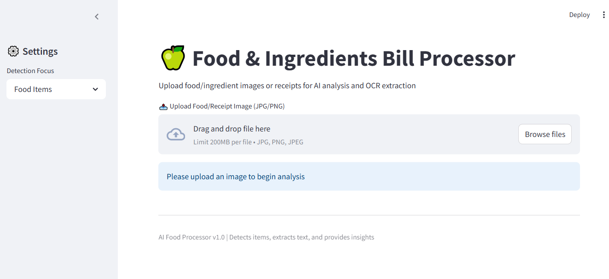

# -Image-and-Document-Processing-

# 🧾 AI-Powered Food & Ingredients Bill Processor

A Streamlit-based application that leverages AI and OCR to intelligently process food-related images such as **ingredient bills**, **product labels**, or **packaged food photos**. The system performs object detection, OCR, and generates insights from images uploaded by the user.

## 📌 Project Features

- 📷 Upload images of food, ingredients, or grocery bills
- 🧠 AI-generated image descriptions with context (e.g., food items, receipts)
- 🔍 Mock object detection based on selected mode (Food Items, Ingredients, Receipts)
- 🔡 OCR (Optical Character Recognition) using **EasyOCR** to extract text from images
- 💡 Automatic extraction of key insights like total amounts and expiry dates
- 📊 Visual display of detected items using bounding boxes
  ## UI Preview
   <!-- Add screenshot after UI is done -->

## 💡 Use Cases

- Scanning grocery receipts for digital records
- Detecting expired or important date-related content
- Identifying key ingredients in packaged food
- Converting handwritten or printed bills into readable text

 

 
